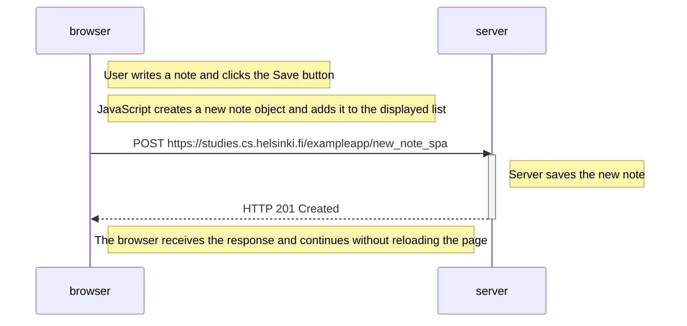

```mermaid
sequenceDiagram
    participant browser
    participant server

    Note right of browser: User writes a note and clicks the Save button

    Note right of browser: JavaScript creates a new note object and adds it to the displayed list

    browser->>server: POST https://studies.cs.helsinki.fi/exampleapp/new_note_spa
    activate server
    Note right of server: Server saves the new note
    server-->>browser: HTTP 201 Created
    deactivate server

    Note right of browser: The browser receives the response and continues without reloading the page
```